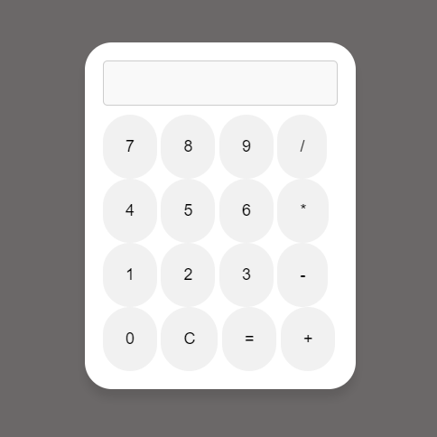

# Calculadora Simples

Uma calculadora feita com **HTML**, **CSS** e **JavaScript**. Ela realiza operações básicas como soma, subtração, multiplicação e divisão.

## Funcionalidades

- Realiza operações de soma, subtração, multiplicação e divisão.
- Permite adicionar números com ponto decimal.
- Previne divisão por zero.

## Como Usar

1. Abra o arquivo `index.html` no seu navegador.
2. Clique nos botões para inserir os números e realizar as operações.
3. Clique em **=** para calcular o resultado.
4. Clique em **C** para limpar a tela.

## Tecnologias

- **HTML**
- **CSS**
- **JavaScript**

## Imagem da Calculadora

Aqui está uma captura de tela da calculadora funcionando:

 <!-- Substitua com o caminho para a sua imagem -->
